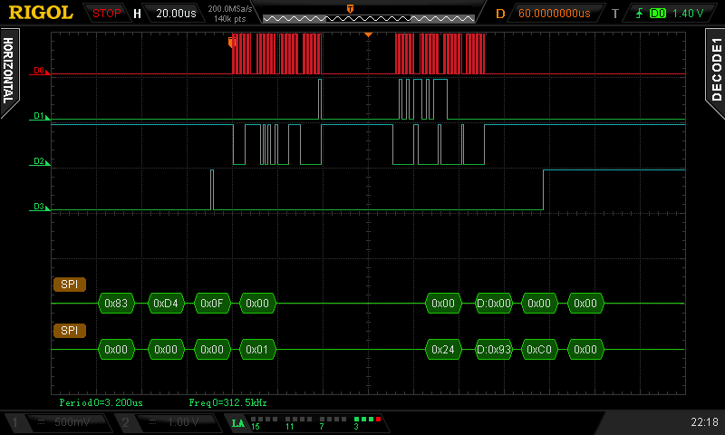

# Zephyr TPM Driver

## Overview
This repo contains a port of the linux tpm-tis-spi driver. The original
source is in `linux/drivers/char/tpm/tpm_tis_spi_main.c`. It is intended
to be used in conjunction with https://github.com/tpm2-software/tpm2-tss.

## Chip-Select Handling
One uC to TPM command consists of at least two independent spi-api calls.
The specification defines that the CS may not be released between those
two calls. The image below illustrates a read of 4 bytes (vendor-id). The
first 4 bytes are sent by the uC on D2 (MOSI). The Response is received on
D1 (MISO) – also 4 bytes. D3 Is the chip select and is held down for the
entire time (the glitch at the beginning is caused by the uC startup and 
can be ignored in this demonstration). D0 is the clock signal at 1 MHz.

I was not able to achieve this behavior with a in hardware chip select. The
current implementation therefore switches the pin into GPIO alt mode.
